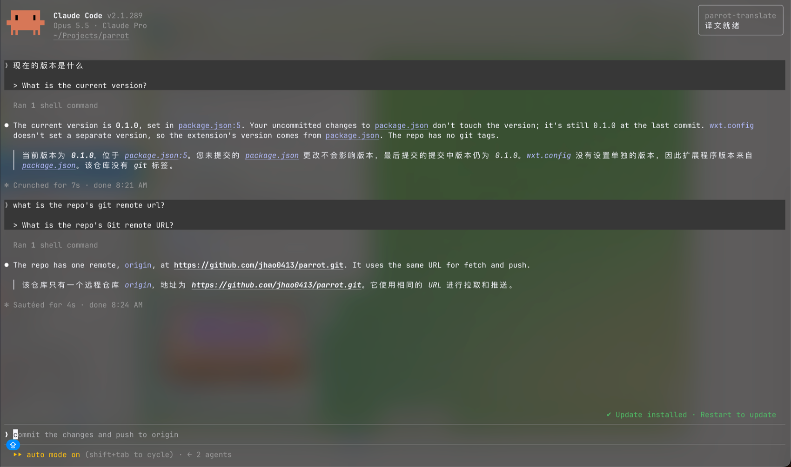

# parrot-agent-extensions

面向 Claude Code 和 Pi 的语言辅助扩展。parrot-translate 将外文提示词翻成英文，回复和思考内容按需译回你的语言。



## Pi 安装

```bash
pi install npm:pi-parrot-translate
```

重启 Pi，或在已有会话中运行 `/reload`。完整说明见 [Pi 安装与使用](pi/README.md)。

## Claude Code 安装

```bash
claude plugin marketplace add jhao0413/parrot-agent-extensions
claude plugin install parrot-translate@parrot-agent-extensions
```

需要 Claude Code v2.1.287+（mods API）。完整说明见 [Claude Code 安装与使用](claude/parrot-translate/README.md)。

## 使用说明

- [Pi 安装与使用](pi/README.md)
- [Claude Code 安装与使用](claude/parrot-translate/README.md)

回复译文只影响显示，不写入模型上下文；会话保存实际发送的提示词。默认使用微软翻译接口，也可以配置会话模型或 OpenAI 兼容服务。

## 致谢

感谢 [Linux.do 社区](https://linux.do) 的支持与帮助。
